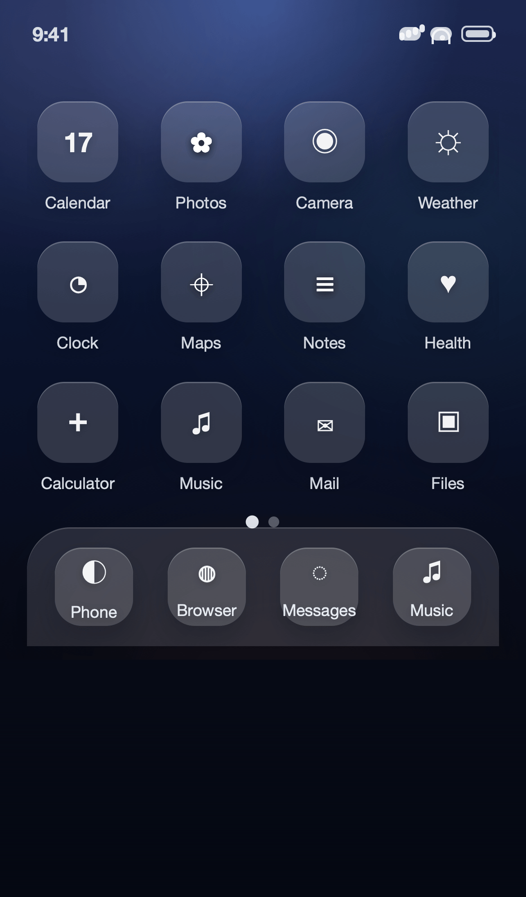
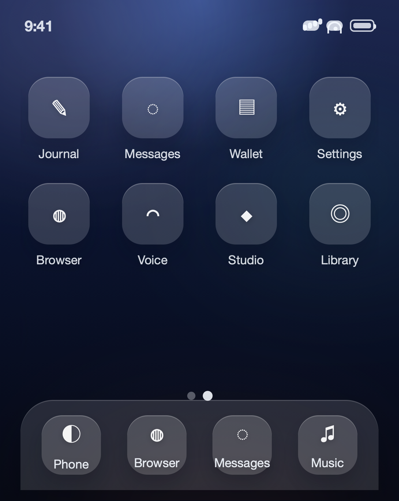
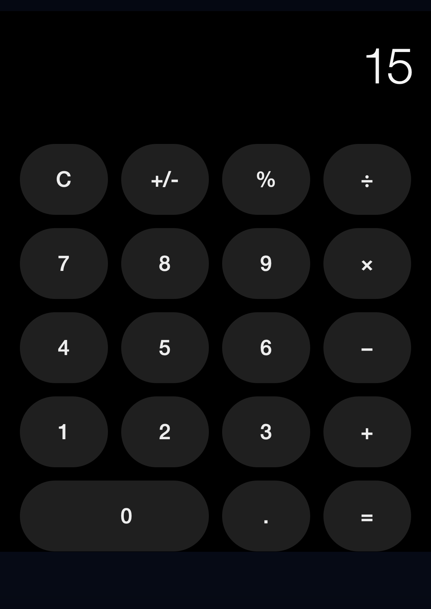
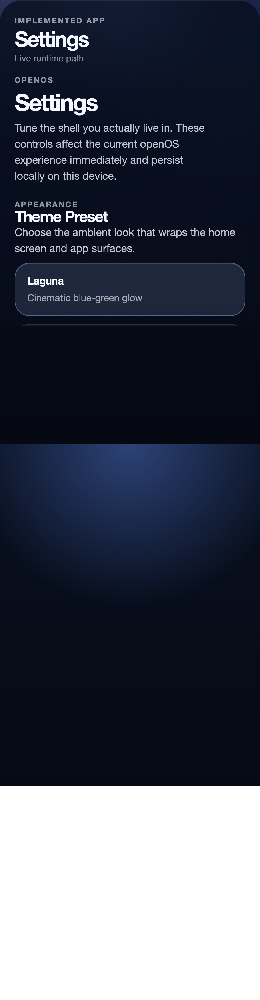
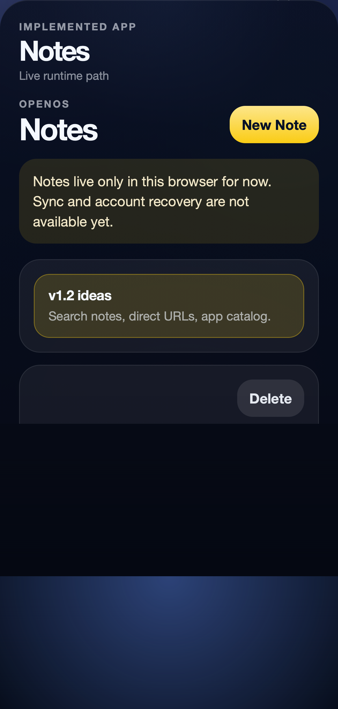
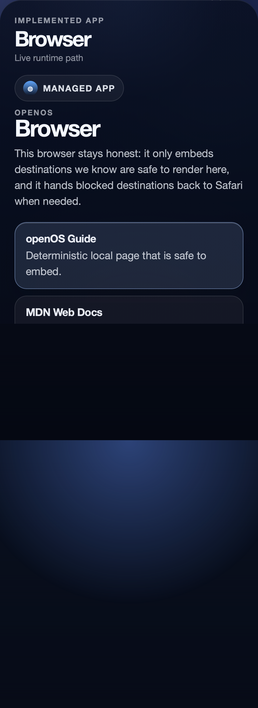

# openOS

<!-- bright-builds-rules-readme-badges:begin -->
<!-- Managed upstream by bright-builds-rules. If this badge block needs a fix, open an upstream PR or issue instead of editing the downstream managed block. Keep repo-local README content outside this managed badge block. -->
[](https://github.com/bright-builds-llc/openOS)
[](./LICENSE)
[](https://www.typescriptlang.org/)
[](https://react.dev/)
[](https://vite.dev/)
[](https://github.com/bright-builds-llc/bright-builds-rules)
<!-- bright-builds-rules-readme-badges:end -->

openOS is a mobile web experience that aims to feel nearly indistinguishable from using an iPhone when opened fullscreen on an iPhone in portrait mode. `v1.1` shipped the first believable multi-app system with multi-page home screens, Calculator, `Settings`, local-only `Notes`, a truthful managed-iframe `Browser`, and shared internal app-platform primitives. `v1.2` is now focused on Notes growth, careful Browser expansion, and the first contributor-facing app distribution groundwork.



## What's shipped in `v1.1`

- Multi-page home-screen launcher with active page indicators and return-to-origin behavior
- High-fidelity portrait Calculator running through the shared launcher/runtime path
- Real `Settings` app with persistent preferences and internal app-management surface
- Real local-only `Notes` app with browser-verified persistence and honest no-sync messaging
- Truthful managed-iframe `Browser` with curated destinations and graceful fallback
- Shared app-platform primitives for app definitions, settings participation, and storage namespaces

## Visual tour

### Home pages



### Calculator



### Settings



### Notes



### Browser



## Demo status

Public demo URL: **Unavailable today**. The README visuals are generated from the real shipped launcher/app flows in this repo, and the next milestone is tracked in [.planning/PROJECT.md](.planning/PROJECT.md).

## Quickstart

```bash
bun install
bun run dev
bun run build
bun run test
bun run test:e2e
bun run verify:v1.2
```

Use `bun run dev` for local iteration. Vite will print the local URL. Use `bun run test:e2e` to run the WebKit iPhone launcher-path suite against the built preview app.

## Project status

- **Shipped version:** `v1.1` on 2026-04-09
- **Current milestone:** `v1.2 Notes, Browser & Platform Growth`
- **Milestone history:** [.planning/MILESTONES.md](.planning/MILESTONES.md)
- **Archived milestone roadmaps:** [.planning/milestones](.planning/milestones)
- **Current project framing:** [.planning/PROJECT.md](.planning/PROJECT.md)

## Submission foundations

Phase `18` adds the first repo-driven app submission contract for future catalog work. The checked-in sample manifest and workflow notes live in [docs/app-submissions.md](docs/app-submissions.md), and the repo-owned validator runs with:

```bash
bun run submissions:check
```

## Maintaining README media

- Generate fresh artifact-only media locally:

  ```bash
  bun run readme:media
  ```

- Refresh tracked README media in `docs/readme-media/`:

  ```bash
  bun run readme:media:update
  ```

- Check whether tracked media has drifted from a fresh capture:

  ```bash
  bun run readme:media:check
  ```

The capture flow uses the real Playwright launcher helpers from `tests/e2e/fixtures/launcher.ts`. Static screenshots are tracked under `docs/readme-media/`. The animated README asset is a GIF for GitHub rendering. The capture script also emits an MP4 artifact for review, but that video is not required by the README itself.

The GitHub Actions workflow at `.github/workflows/readme-media-refresh.yml` supports:
- manual refresh runs that update tracked media and open/update a PR
- nightly capture runs that upload fresh artifacts and a drift summary without mutating the repo

## Contributing

Start with [CONTRIBUTING.md](CONTRIBUTING.md) for the repo-wide contribution expectations. Follow [AGENTS.md](AGENTS.md) for repo-local engineering rules. For project planning context, use [.planning/PROJECT.md](.planning/PROJECT.md), [.planning/ROADMAP.md](.planning/ROADMAP.md), and [.planning/MILESTONES.md](.planning/MILESTONES.md).

## License

Licensed under the [MIT License](LICENSE).
